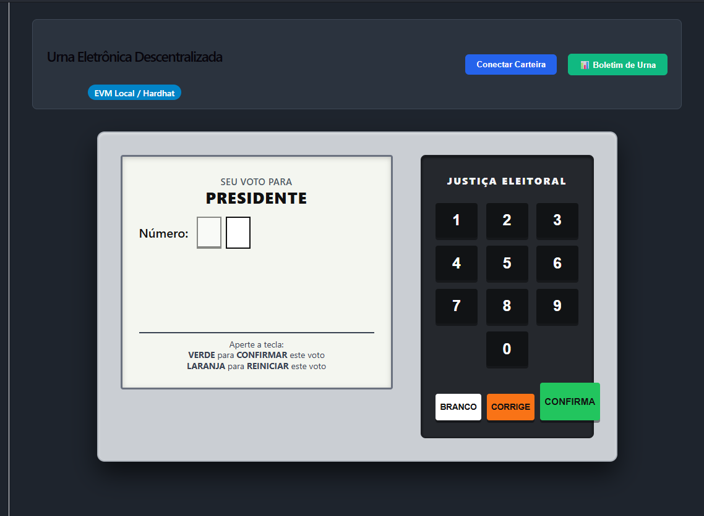

# 🗳️ Urna Eletrônica Descentralizada (Web3 / Blockchain)

Um simulador da urna eletrônica brasileira baseado em contratos inteligentes na EVM (Ethereum Virtual Machine). O projeto demonstra como a tecnologia blockchain garante a **segurança**, a **imutabilidade**, a **prevenção de voto duplo** e, principalmente, a **apuração automatizada e instantânea** dos votos.


---

## 🌐 Demonstração Online

* 🔗 **Aplicação em Produção:** [https://urna-blockchain-lac.vercel.app/](https://urna-blockchain-lac.vercel.app/)
* 📜 **Smart Contract (Sepolia Etherscan):** [`0x94e811c951dbf0c8d4f008d6aac9713cea488125`](https://sepolia.etherscan.io/address/0x94e811c951dbf0c8d4f008d6aac9713cea488125)

---

## 📸 Demonstração da Interface




---

## 🏗️ Arquitetura e Regras de Negócio

1. **Voto Secreto a Nível de Estado:**
   * O contrato registra apenas que a carteira votou (`jaVotou[msg.sender] = true`), incrementando os contadores atômicos sem manter relação entre a identidade do eleitor e o candidato escolhido no armazenamento (*storage*).
2. **Prevenção de Voto Duplo:**
   * Modificadores e validações revertem transações caso um mesmo endereço tente votar mais de uma vez.
3. **Padrão da Urna Brasileira:**
   * **Voto Nominal:** O eleitor digita 2 dígitos válidos e confirma.
   * **Voto em Branco:** Acionado via tecla física `BRANCO`.
   * **Voto Nulo:** Qualquer número de 2 dígitos não registrado é classificado e totalizado como nulo.
   * **Correção:** Tecla `CORRIGE` limpa o estado da tela para nova digitação.
4. **Apuração Instantânea (Boletim de Urna):**
   * Cada voto minerado atualiza os contadores no mesmo bloco. O resultado geral e por candidato é consultado em $O(1)$ por chamadas de leitura (`view`), sem processamento posterior ou intervenção humana.
5. **Feedback Auditivo Realista:**
   * Sons característicos de digitação de teclas e o sinal de encerramento gerados nativamente via Web Audio API.

---

## 🛠️ Stack Tecnológica

* **Smart Contracts:** Solidity (`^0.8.20`)
* **Ambiente de Desenvolvimento:** Hardhat 3 (EVM local)
* **Comunicação Web3 / Testes do Hardhat:** Viem + Node Test Runner (`node:test`, `node:assert`)
* **Frontend:** React + TypeScript (Vite)
* **Integração Web3 no Frontend:** Ethers.js (`v6`)
* **Estilização:** CSS3 puro simulando o gabinete e teclado físico da urna

---

## 📂 Estrutura do Projeto

```text
urna-blockchain/
├── contracts/               # Camada Blockchain (Hardhat 3)
│   ├── contracts/           # Smart contracts em Solidity
│   │   └── urnaEletronica.sol
│   ├── scripts/             # Scripts de deploy e população inicial
│   │   └── deploy.ts
│   ├── test/                # Testes unitários de regras de negócio
│   │   └── UrnaEletronica.test.ts
│   └── hardhat.config.ts
├── frontend/                # Aplicação Web (React + TypeScript)
│   ├── src/
│   │   ├── components/      # Visor, Teclado e Painel de Apuração
│   │   ├── constants/       # Endereço e ABI do contrato
│   │   ├── hooks/           # useUrna (conexão Ethers e chamadas RPC)
│   │   └── utils/           # Síntese de áudio nativa
│   └── package.json
└── README.md
```

---

## 🚀 Como Executar o Projeto

### Pré-requisitos

* Node.js (versão 18 ou superior)
* Extensão MetaMask instalada no navegador

### 1. Clonar o Repositório e Instalar Dependências

```bash
git clone <URL_DO_REPOSITORIO>
cd urna-blockchain
```

Instale as dependências da camada de contratos e do frontend:

```bash
# Na pasta contracts
cd contracts
npm install

# Na pasta frontend
cd ../frontend
npm install
```

### 2. Executar os Testes Automatizados

Para verificar a integridade das regras de negócio e bloqueios antifraude:

```bash
cd contracts
npx hardhat test
```

### 3. Iniciar o Nó Local e Fazer o Deploy

Abra dois terminais na pasta `contracts`:

**Terminal 1 (Nó Local da Blockchain):**

```bash
npx hardhat node
```

Mantenha esse terminal aberto. Ele fornecerá 20 contas com 10.000 ETH cada e o endpoint RPC (`http://127.0.0.1:8545`).

**Terminal 2 (Deploy e Semeadura de Candidatos):**

```bash
npx hardhat run scripts/deploy.ts --network localhost
```

O script implantará o contrato, cadastrará os candidatos padrão (13, 22 e 30) e iniciará a eleição.

### 4. Configurar a MetaMask

Abra a MetaMask e adicione a rede local:

* **Nome da Rede:** Hardhat Localhost
* **URL do RPC:** `http://127.0.0.1:8545`
* **ID da Cadeia (Chain ID):** `31337`
* **Símbolo da Moeda:** ETH

Importe uma conta de teste do Hardhat:

1. No menu de contas da MetaMask, clique em **Adicionar conta ou hardware** > **Importar conta**.
2. Cole uma das Chaves Privadas (Private Keys) exibidas no Terminal 1 (exemplo da Conta #1):

```text
0x59c6995e998f97a5a0044966f0945389dc9e86dae88c7a8412f4603b6b78690d
```

### 5. Iniciar o Frontend

Na pasta `frontend`, execute:

```bash
npm run dev
```

Acesse a URL indicada (geralmente `http://localhost:5173`) no navegador.

---

## 🗳️ Como Votar e Auditar

1. Clique em **Conectar Carteira** no canto superior direito para vincular a conta importada da MetaMask.
2. Na urna:
   * Digite `13`, `22` ou `30` para voto nominal.
   * Digite qualquer outro número de 2 dígitos para voto nulo.
   * Pressione `BRANCO` para voto em branco.
3. Pressione a tecla verde `CONFIRMA` e aprove a transação na MetaMask.
4. Após o som de confirmação e a tela de **FIM**, clique em **📊 Boletim de Urna** no topo para acompanhar a apuração instantânea gravada na blockchain.

---
